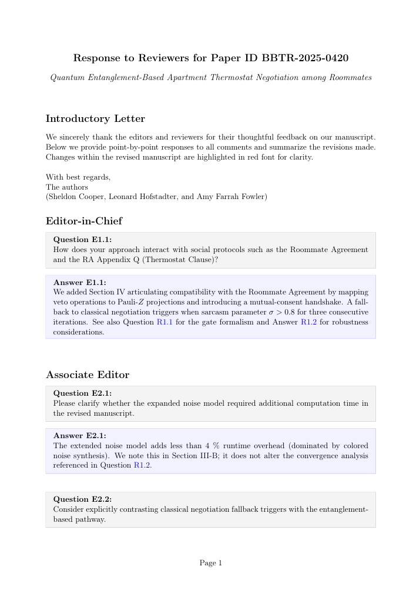

# Response-to-Reviewers Letter Template

This repository provides a LaTeX template to write clear, well-structured responses to editors and reviewers during scientific peer review.

The main files are:
- `reviewresponse.sty` — the style file with all environments and commands
- `main.tex` — an example letter showing typical usage

## Example Output



## Quick start

1) Set your metadata near the top of `main.tex`:
- `\paperid{...}`
- `\papertitle[Short Title]{Long Title}`

2) For each editor or reviewer, start a section and add Q/A items:
- `\editorsection{Editor-in-Chief}` (E-prefixed numbering: E1.1, E1.2, ...)
- `\editorsection{Associate Editor}` (increments the editor counter → E2.1, ...)
- `\reviewersection{Reviewer 1}` (R-prefixed numbering: R1.1, R1.2, ...)
- `\begin{question}[q:label] ... \end{question}`
- `\begin{answer}[a:label] ... \end{answer}`

3) Reference items anywhere in the letter:
- Questions: `\qref{q:label}` → “Question E1.2” or “Question R2.3” (prefix reflects section type)
- Answers: `\aref{a:label}` → “Answer E1.2” or “Answer R2.3”
- Figures: `\figref{fig:label}` → “Fig. R1”
- Tables: `\tableref{tab:label}` → “Tab. R1”

4) Compile (uses biblatex + biber):

```powershell
# Minimal manual sequence
pdflatex main.tex
biber main
pdflatex main.tex
pdflatex main.tex

# Or with latexmk (if installed)
latexmk -pdf -interaction=nonstopmode -halt-on-error main.tex
```


## Core concepts and commands

Metadata
- `\paperid{...}` set once; `\printpaperid` prints it
- `\papertitle[Short]{Long}` sets both long and optional short titles; `\printpapertitle` prints the long title

Section types and numbering
- `\editorsection{<name>}`: increments an editor counter; Q/A become E<editorIndex>.<item>
- `\reviewersection{<name>}`: increments a reviewer counter; Q/A become R<reviewerIndex>.<item>
- Separate sequences mean Editor questions (E...) and Reviewer questions (R...) never collide

Q/A environments (boxed)
- `\begin{question}[<opt-label>] ... \end{question}`
- `\begin{answer}[<opt-label>] ... \end{answer}`
- Optional labels let you cross-reference specific items
- Boxes have no first-line indent; a small vertical space follows each answer to visually group Q/A pairs

Cross-referencing helpers
- `\qref{q:...}` → “Question E1.1” or “Question R2.4” (automatically includes E/R + numbering)
- `\aref{a:...}` → “Answer E1.1” or “Answer R2.4”
- `\figref{fig:...}` → “Fig. A<n>` (figure numbering independent of editor/reviewer context; R-prefix refers to response artifact numbering)
- `\tabref{tab:...}` or `\tableref{tab:...}` → “Tab. A<n>`

Figures and tables inside answers (no floats)
- Floats (\`figure\`, \`table\`) don’t play well inside framed environments
- Instead, embed content with `\captionof` from the `caption` package:

```latex
\begin{center}
	\begin{minipage}{0.9\linewidth}
		% your graphic/table here
		\captionof{figure}{A non-floating figure inside an answer.}
		\label{fig:R-example}
	\end{minipage}
\end{center}
```

Numbering conventions
- Editor Q/A: E<editorIndex>.<item> (e.g., E1.1, E1.2, then E2.1 for a new editor section)
- Reviewer Q/A: R<reviewerIndex>.<item> (e.g., R1.3)
- Response artifacts (equations, figures, tables): global A-prefixed sequence (e.g., Eq. A5, Fig. A2, Tab. A3)

Bibliography
- Uses `biblatex` (style: ieee) and `biber`
- Add entries to `references.bib` and end your document with `\printbibliography`
- Citation links are black for easy printing: `\usepackage[colorlinks=true,linkcolor=blue,citecolor=black]{hyperref}`


## Minimal example

```latex
\paperid{ABC-2025-0001}
\papertitle[Short Response Title]{Full Response Title Used on the Front Page}

\editorsection{Editor-in-Chief}

\begin{question}[q:ei-scope]
Please summarize the added validation experiments.
\end{question}
\begin{answer}[a:ei-scope]
We added cross-dataset validation and clarify runtime overhead (<5%).
\end{answer}

\reviewersection{Reviewer 1}

\begin{question}[q:r1-ablation]
Provide an ablation of the new filtering module.
\end{question}
\begin{answer}[a:r1-ablation]
See \tableref{tab:ablation}; accuracy improves +3 \% over baseline.
\begin{center}
  \begin{minipage}{0.9\linewidth}
    \centering
    \begin{tabular}{lc} \hline
      Variant & Accuracy \\ \hline
      Baseline & 0.90 \\
      + Filter & 0.93 \\
      + Filter + Augment & 0.94 \\ \hline
    \end{tabular}
    \captionof{table}{A small ablation table.}
    \label{tab:ablation}
  \end{minipage}
\end{center}
\end{answer}

As noted in \qref{q:r1-ablation}, we now provide reproducible settings.
```


## Tips and troubleshooting

- Avoid `\begin{figure}` / `\begin{table}` floats inside `question`/`answer` boxes; use `\captionof` instead
- To reference equations, use standard `\eqref{...}`; they’ll appear as R-prefixed (e.g., A5)
- If a reference shows as “??”, re-run the LaTeX cycle until references resolve (pdflatex → biber → pdflatex ×2)
- The footer page number is centered across the physical page; no header is used by default


## Customization

- Change names: `\renewcommand*{\figurename}{Fig.}` / `\renewcommand*{\tablename}{Tab.}`
- Change numbering: update the `\theequation` / `\thefigure` / `\thetable` redefinitions in `reviewresponse.sty`
- Spacing: adjust the `\vspace{...}` at the end of the `answer` environment if you want tighter/looser grouping


## License

See `LICENSE` for details.